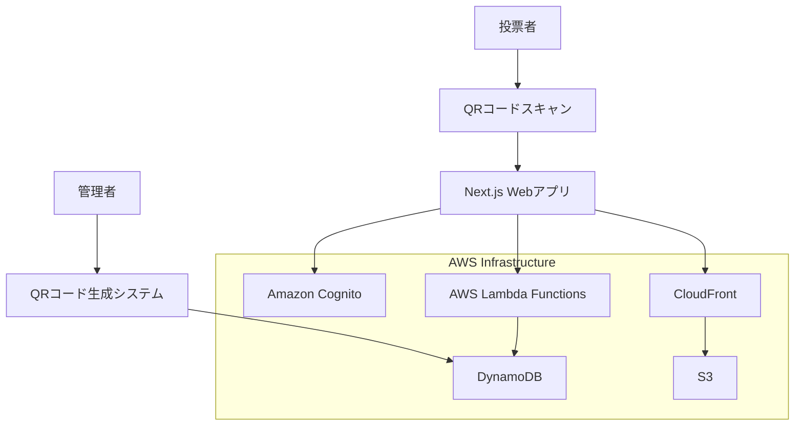
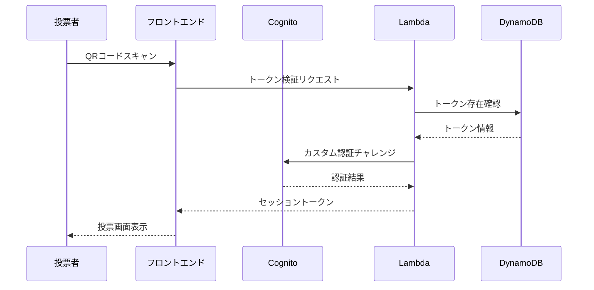

# 設計書

## 概要

オンライン投票アプリケーションは、QRコードベースの認証システムを使用して、安全で期間限定の投票を実現します。Next.js + TypeScriptのフロントエンド、AWS Amplify Gen2 + CDKのバックエンド、Amazon Cognitoの認証、DynamoDBのデータストレージを組み合わせて構築されます。

## アーキテクチャ

### システム全体図



### 技術スタック詳細

- **フロントエンド**: Next.js 14 + TypeScript + Tailwind CSS
- **バックエンド**: AWS Amplify Gen2 + AWS CDK Constructs
- **認証**: Amazon Cognito (カスタム認証フロー)
- **データベース**: Amazon DynamoDB
- **ホスティング**: AWS Amplify Hosting
- **API**: AWS Lambda + API Gateway (Amplify Gen2経由)

## コンポーネントと インターフェース

### フロントエンドコンポーネント

#### 1. QRコードスキャナーコンポーネント
```typescript
interface QRScannerProps {
  onScanSuccess: (token: string) => void;
  onScanError: (error: string) => void;
}
```

#### 2. 候補者リストコンポーネント
```typescript
interface CandidateListProps {
  candidates: Candidate[];
  selectedCandidate: string | null;
  onCandidateSelect: (candidateId: string) => void;
  disabled: boolean;
}
```

#### 3. 投票確認コンポーネント
```typescript
interface VoteConfirmationProps {
  candidate: Candidate;
  onConfirm: () => void;
  onCancel: () => void;
}
```

### バックエンドAPI

#### 1. 認証API
```typescript
// QRコードトークン検証
POST /auth/verify-qr-token
{
  "token": "string",
  "timestamp": "ISO8601"
}

// レスポンス
{
  "isValid": boolean,
  "voterId": "string",
  "sessionToken": "string"
}
```

#### 2. 投票API
```typescript
// 候補者リスト取得
GET /voting/candidates

// 投票送信
POST /voting/cast-vote
{
  "candidateId": "string",
  "voterToken": "string"
}

// 投票状況確認
GET /voting/status
```

#### 3. 管理API
```typescript
// QRコード生成
POST /admin/generate-qr-codes
{
  "count": number,
  "votingSessionId": "string"
}

// 投票期間設定
POST /admin/voting-period
{
  "startTime": "ISO8601",
  "endTime": "ISO8601"
}
```

## データモデル

### DynamoDBテーブル設計

#### 1. VotingTokensテーブル
```typescript
interface VotingToken {
  pk: string;               // PK: votingSessionId#tokenId (ホットパーティション回避)
  hashedToken: string;      // QRコードのハッシュ値（AES-GCM 256 + HMAC署名）
  isUsed: boolean;         // 使用済みフラグ
  voterId: string;         // 投票者ID（匿名化）
  createdAt: string;       // 作成日時
  usedAt?: string;         // 使用日時
  ttl: number;             // TTL属性（期限切れ自動削除）
  votingSessionId: string; // GSI PK
}
```

#### 2. Votesテーブル
```typescript
interface Vote {
  pk: string;               // PK: votingSessionId#voteId
  sk: string;               // SK: candidateId#timestamp (LSI用)
  candidateId: string;      // GSI PK（開票時の集計用）
  voterHash: string;        // 投票者の匿名ハッシュ
  timestamp: string;        // 投票日時
  votingSessionId: string;  // 投票セッションID
}
```

#### 3. Candidatesテーブル
```typescript
interface Candidate {
  candidateId: string;      // PK
  name: string;            // 候補者名
  description?: string;     // 説明
  imageUrl?: string;       // 画像URL
  votingSessionId: string; // GSI PK
  displayOrder: number;    // 表示順序
}
```

#### 4. VotingSessionsテーブル
```typescript
interface VotingSession {
  sessionId: string;        // PK
  title: string;           // 投票タイトル
  description?: string;     // 説明
  startTime: string;       // 開始時刻
  endTime: string;         // 終了時刻
  status: 'PENDING' | 'ACTIVE' | 'CLOSED';
  createdAt: string;
  updatedAt: string;
}
```

## エラーハンドリング

### エラータイプ定義
```typescript
enum VotingErrorType {
  INVALID_QR_CODE = 'INVALID_QR_CODE',
  ALREADY_VOTED = 'ALREADY_VOTED',
  VOTING_CLOSED = 'VOTING_CLOSED',
  VOTING_NOT_STARTED = 'VOTING_NOT_STARTED',
  INVALID_CANDIDATE = 'INVALID_CANDIDATE',
  NETWORK_ERROR = 'NETWORK_ERROR',
  SYSTEM_ERROR = 'SYSTEM_ERROR'
}

interface VotingError {
  type: VotingErrorType;
  message: string;
  retryable: boolean;
  timestamp: string;
}
```

### エラーハンドリング戦略
- **クライアントサイド**: React Error Boundaryとtoast通知
- **サーバーサイド**: CloudWatch Logsへの詳細ログ記録
- **ユーザー体験**: 分かりやすい日本語エラーメッセージ
- **リトライ機能**: ネットワークエラー時の自動リトライ

## セキュリティ設計

### 1. QRコード認証強化
- **暗号化**: AES-GCM 256 + HMAC署名でクライアント側復号不能
- **一度限り使用**: DynamoDB条件付き書き込みで排他制御
- **有効期限**: TTL属性による期限切れ自動削除
- **署名検証**: サーバーサイドでHMAC署名の完全性確認

### 2. 重複投票防止強化
- **強整合性読み取り**: 直後の再投票を確実に防止
- **冪等性保証**: Idempotency-Tokenヘッダによる重複リクエスト防止
- **匿名性確保**: 投票者IDのハッシュ化（SHA-256 + Salt）
- **条件付き書き込み**: DynamoDBのConditionExpressionで排他制御

### 3. データ保護・監査証跡
- **暗号化**: DynamoDB + KMS暗号化、転送時HTTPS強制
- **監査ログ**: CloudWatch Logs + KMS暗号化
- **長期保管**: S3 Glacier Deep Archiveで証跡保管
- **改竄防止**: CloudTrail Lakeで API呼び出し集約・検証
- **CORS設定**: 厳格なオリジン制限

### 4. 認証フロー


## テスト戦略

### 1. ユニットテスト
- **フロントエンド**: Jest + React Testing Library
- **バックエンド**: Jest + AWS SDK mocks
- **カバレッジ目標**: 80%以上

### 2. 統合テスト
- API エンドポイントテスト
- DynamoDB操作テスト
- Cognito認証フローテスト

### 3. E2Eテスト
- Playwright使用
- 投票フロー全体のテスト
- エラーシナリオテスト

### 4. セキュリティテスト
- 重複投票防止テスト
- 不正アクセステスト
- QRコード偽造テスト

### 5. パフォーマンステスト
- 同時投票者数テスト
- レスポンス時間測定
- DynamoDB読み書き性能テスト

## デプロイメント設計

### 1. 環境構成
- **開発環境**: ローカル開発 + AWS Dev環境
- **ステージング環境**: 本番同等構成でのテスト
- **本番環境**: 高可用性構成

### 2. CI/CDパイプライン
- GitHub Actions使用
- 自動テスト実行
- Amplify Gen2による自動デプロイ

### 3. モニタリング
- CloudWatch メトリクス
- X-Ray トレーシング
- Real User Monitoring (RUM)

## スケーラビリティ考慮事項

### 1. DynamoDB設計
- オンデマンド課金モード
- GSIによる効率的なクエリ
- 適切なパーティションキー設計

### 2. Lambda関数
- 同時実行数制限の設定
- メモリとタイムアウトの最適化
- コールドスタート対策

### 3. フロントエンド
- CDN配信（CloudFront）
- 静的アセットの最適化
- レスポンシブデザイン